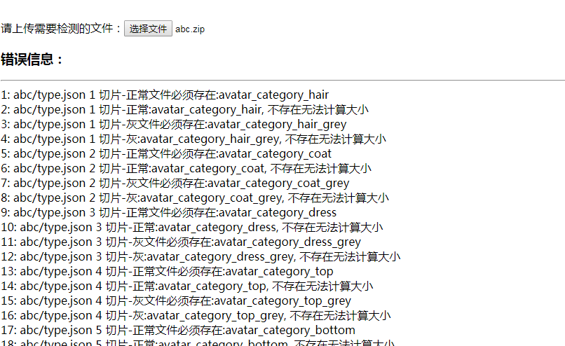

### How to compile this project

```bash
npm run dev
```

复制文件```dist/bundle.js```到你的项目中，如何使用请看```index.html```

```js
$("#file").on("change", function(evt) {
    var files = evt.target.files;
    $('.error').html('请等待，正在检测......')

    require(['./bundle'], function(module) {
        let parser = new module.DressUp.Parser();
        parser.setDebug(true)
        parser.unzip(files[0], 'config.xlsx').then(function(data) {
            console.log(data)

            let content = JSON.stringify(data['json'])
            parser.package(files[0], 'config.json', content).then(function(formData) {
                console.log(formData)
            })
        })
    })
})
```

### Result

